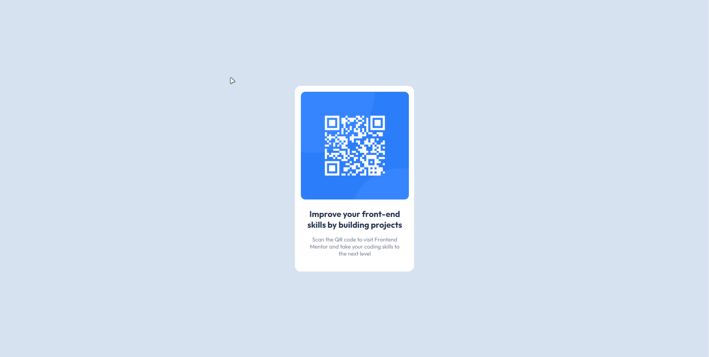

# Frontend Mentor - QR code component solution

This is a solution to the [QR code component challenge on Frontend Mentor](https://www.frontendmentor.io/challenges/qr-code-component-iux_sIO_H). Frontend Mentor challenges help you improve your coding skills by building realistic projects.

## Table of contents

- [Overview](#overview)
  - [Screenshot](#screenshot)
  - [Links](#links)
- [My process](#my-process)
  - [Built with](#built-with)
  - [What I learned](#what-i-learned)
  - [Continued development](#continued-development)
  - [Useful resources](#useful-resources)
- [Author](#author)

## Overview

### Screenshot

### Links

- Solution URL: [Add solution URL here](https://your-solution-url.com)
- Live Site URL: [Add live site URL here](https://your-live-site-url.com)

## My process

### Built with

- Semantic HTML5 markup
- CSS custom properties
- Flexbox
- SCSS

### What I learned

Through this project I learned how to make my own css library using scss.

### Continued development

I intend to use and expand my css library in the next projects.

### Useful resources

- [SASS Tuts by Net Ninja](https://www.youtube.com/playlist?list=PL4cUxeGkcC9jxJX7vojNVK-o8ubDZEcNb) - This helped me learn SCSS and how to make my own css library.

## Author

- Frontend Mentor - [@whatTheFath](https://www.frontendmentor.io/profile/whatTheFath)
- Twitter - [@FathulIrfaan](https://twitter.com/FathulIrfaan)
